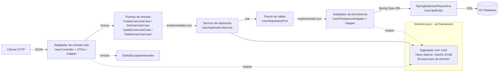
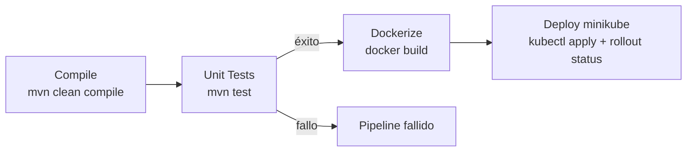

# Design Document

## Overview

Este documento describe el diseño técnico del **mantenedor de usuarios** (CRUD), una API REST construida con Java 21, Spring Boot 3.5.x, Lombok y H2. La aplicación adopta una **arquitectura hexagonal (puertos y adaptadores) con Domain-Driven Design (DDD)**, donde el dominio permanece puro y aislado de cualquier framework, y las tecnologías externas (web REST, persistencia JPA) se conectan a través de adaptadores que implementan o consumen puertos.

La API permite crear, consultar, actualizar y eliminar usuarios, aplicando validación de datos, garantizando la unicidad del email y devolviendo respuestas de error consistentes. El comportamiento funcional, los endpoints (`/api/users`), los códigos HTTP y el manejo de errores se mantienen idénticos; lo que cambia es la organización interna del código.

### Objetivos de diseño

- Aislar el dominio de negocio de los detalles de infraestructura (regla de dependencias hacia el centro).
- Modelar el dominio con DDD: un aggregate root `User` y value objects (`UserId`, `Email`) que encapsulan invariantes.
- Definir puertos explícitos (interfaces) para las entradas (use cases) y las salidas (persistencia).
- Validación declarativa con Jakarta Bean Validation en el borde web, y validación de invariantes en el dominio.
- Manejo de errores centralizado y uniforme en el adaptador web.
- Mantener la persistencia (Spring Data JPA sobre H2) como un detalle intercambiable detrás de un puerto de salida.

### Stack tecnológico

| Componente | Tecnología | Versión |
|------------|-----------|---------|
| Lenguaje | Java | 21 (LTS) |
| Framework | Spring Boot | 3.5.x |
| Persistencia | Spring Data JPA (Hibernate) | Gestionada por Spring Boot |
| Base de datos | H2 (en memoria) | Gestionada por Spring Boot |
| Boilerplate | Lombok | Gestionada por Spring Boot |
| Validación | Jakarta Bean Validation (spring-boot-starter-validation) | Gestionada por Spring Boot |
| Documentación API | springdoc-openapi (Swagger UI) | 2.8.x |
| Build | Maven | 3.9+ |

## Architecture

La aplicación adopta una **arquitectura hexagonal (puertos y adaptadores) con DDD**. El dominio queda en el centro, sin dependencias de frameworks; la aplicación orquesta casos de uso apoyándose solo en el dominio y en puertos; y la infraestructura implementa los adaptadores concretos (web y persistencia) que traducen entre el mundo exterior y el núcleo.



### Capas y responsabilidades

- **Domain (dominio)**: Modelo de negocio puro, sin dependencias de Spring, JPA ni Jakarta Validation.
  - Aggregate root `User`: encapsula el estado (`UserId`, `nombre`, `Email`, `activo`) y las reglas de negocio (por ejemplo, cómo se actualizan sus datos y el valor por defecto de `activo`).
  - Value objects `UserId` (envuelve el `Long` identificador) y `Email` (valida el formato en su constructor).
  - Excepciones de dominio (por ejemplo, `InvalidEmailException`) para violaciones de invariantes.
- **Application (aplicación)**: Orquesta los casos de uso y depende únicamente del dominio.
  - Puertos de entrada (interfaces): `CreateUserUseCase`, `GetUserUseCase`, `UpdateUserUseCase`, `DeleteUserUseCase`.
  - Puerto de salida (interfaz): `UserRepositoryPort`, que expresa las operaciones de persistencia en términos del dominio.
  - `UserApplicationService`: implementa los puertos de entrada, contiene la lógica de aplicación (unicidad de email, verificación de existencia) y es transaccional. Lanza las excepciones de negocio `ResourceNotFoundException` y `DuplicateEmailException`.
- **Infrastructure (infraestructura)**: Adaptadores concretos que dependen de aplicación y dominio.
  - Adaptador de entrada `in.web`: `UserController` (endpoints REST), DTOs (`UserRequest`, `UserResponse`, `ErrorResponse`), un mapper web dominio↔DTO y el `GlobalExceptionHandler`.
  - Adaptador de salida `out.persistence`: `UserJpaEntity` (mapeo a tabla), `SpringDataUserRepository` (interfaz Spring Data JPA), `UserPersistenceAdapter` (implementa `UserRepositoryPort`) y un mapper dominio↔entidad JPA.
  - `config`: `OpenApiConfig` y demás configuración de framework.

### Principios de dependencia (regla hacia el centro)

- El **dominio** no depende de ninguna capa externa ni de ningún framework.
- La **aplicación** depende solo del dominio (y define los puertos como interfaces propias).
- La **infraestructura** depende de la aplicación y del dominio; nunca al revés. Las dependencias apuntan siempre hacia el centro. La inversión de dependencias se logra porque los adaptadores implementan (persistencia) o consumen (web) los puertos definidos en la capa de aplicación.

### Value objects del dominio

- **`Email`**: envuelve la dirección de correo como un valor inmutable. Valida el formato en el constructor y, si es inválido, lanza una excepción de dominio (`InvalidEmailException`). Garantiza que no pueda existir un `User` con un email mal formado dentro del dominio.
- **`UserId`**: envuelve el identificador `Long` del usuario. Aporta seguridad de tipos (evita confundir un id con cualquier otro `Long`) y expresa la identidad del aggregate. Puede representar un identificador aún no asignado (usuario nuevo, previo a la persistencia).

### Estructura de paquetes

```
com.example.usercrud
├── UserCrudApplication.java
├── domain
│   ├── model
│   │   ├── User.java              (aggregate root)
│   │   ├── UserId.java            (value object)
│   │   └── Email.java             (value object)
│   └── exception
│       └── InvalidEmailException.java
├── application
│   ├── port
│   │   ├── in
│   │   │   ├── CreateUserUseCase.java
│   │   │   ├── GetUserUseCase.java
│   │   │   ├── UpdateUserUseCase.java
│   │   │   └── DeleteUserUseCase.java
│   │   └── out
│   │       └── UserRepositoryPort.java
│   └── service
│       └── UserApplicationService.java
└── infrastructure
    ├── adapter
    │   ├── in
    │   │   └── web
    │   │       ├── UserController.java
    │   │       ├── GlobalExceptionHandler.java
    │   │       ├── dto
    │   │       │   ├── UserRequest.java
    │   │       │   ├── UserResponse.java
    │   │       │   └── ErrorResponse.java
    │   │       └── mapper
    │   │           └── UserWebMapper.java
    │   └── out
    │       └── persistence
    │           ├── UserJpaEntity.java
    │           ├── SpringDataUserRepository.java
    │           ├── UserPersistenceAdapter.java
    │           └── UserPersistenceMapper.java
    └── config
        └── OpenApiConfig.java
```

> Las excepciones de negocio de aplicación (`ResourceNotFoundException`, `DuplicateEmailException`) viven en la capa de aplicación (por ejemplo, en `application.exception`), ya que representan resultados de casos de uso, no invariantes del dominio. El `GlobalExceptionHandler` del adaptador web las traduce a respuestas HTTP.

## Components and Interfaces

### Dominio: aggregate root User y value objects

El dominio es puro (sin JPA ni Spring). El aggregate root `User` mantiene sus invariantes y se construye siempre en un estado válido. El identificador se modela con `UserId` y el correo con `Email`.

```java
// domain.model.UserId
public record UserId(Long value) {
    public static UserId of(Long value) {
        return new UserId(value);
    }
    public boolean isAssigned() {
        return value != null;
    }
}
```

```java
// domain.model.Email — valida el formato en el constructor
public record Email(String value) {
    private static final Pattern PATTERN =
            Pattern.compile("^[^@\\s]+@[^@\\s]+\\.[^@\\s]+$");

    public Email {
        if (value == null || !PATTERN.matcher(value).matches()) {
            throw new InvalidEmailException("El formato del email es inválido: " + value);
        }
    }
}
```

```java
// domain.model.User — aggregate root, sin anotaciones de framework
public class User {
    private final UserId id;      // puede envolver null si aún no está persistido
    private String nombre;
    private Email email;
    private boolean activo;

    // Constructor para un usuario nuevo (sin id); activo por defecto true.
    // Constructor/rehidratación para un usuario existente (con id).
    // Método de negocio para actualizar nombre, email y activo.
    // Getters de solo lectura.
}
```

El aggregate concentra las reglas: aplicar `activo = true` por defecto cuando no se especifica y actualizar sus datos de forma controlada. La validación de formato del email queda garantizada por el value object `Email`.

_Requisitos cubiertos: 5.1, 5.2, 5.3._

### Puertos de entrada (application.port.in)

Cada caso de uso se expresa como una interfaz. `UserApplicationService` las implementa todas.

| Puerto | Método | Descripción | Excepciones |
|--------|--------|-------------|-------------|
| `CreateUserUseCase` | `UserResponse create(UserRequest req)` | Crea un usuario, valida email único | `DuplicateEmailException` |
| `GetUserUseCase` | `List<UserResponse> findAll()` / `UserResponse findById(Long id)` | Lista o consulta usuarios | `ResourceNotFoundException` |
| `UpdateUserUseCase` | `UserResponse update(Long id, UserRequest req)` | Actualiza un usuario | `ResourceNotFoundException`, `DuplicateEmailException` |
| `DeleteUserUseCase` | `void delete(Long id)` | Elimina un usuario | `ResourceNotFoundException` |

> Los comandos/consultas pueden expresarse con los DTOs del borde o con tipos de comando propios de la aplicación; para mantener el comportamiento actual se reutilizan `UserRequest`/`UserResponse` como contrato de entrada/salida de los use cases.

_Requisitos cubiertos: 1.1, 2.1, 2.2, 3.1, 4.1._

### Puerto de salida: UserRepositoryPort (application.port.out)

Interfaz definida por la aplicación y expresada en términos del **dominio** (no de JPA). El adaptador de persistencia la implementa.

```java
public interface UserRepositoryPort {
    User save(User user);
    Optional<User> findById(UserId id);
    List<User> findAll();
    boolean existsByEmail(Email email);
    Optional<User> findByEmail(Email email);
    void deleteById(UserId id);
}
```

`existsByEmail` se usa para validar unicidad en creación; en actualización se comprueba que el email no pertenezca a otro usuario distinto.

_Requisitos cubiertos: 1.4, 3.4._

### Servicio de aplicación: UserApplicationService (application.service)

Implementa los cuatro puertos de entrada y depende solo del dominio y de `UserRepositoryPort`. Es transaccional (`@Transactional` en escritura). No conoce ni JPA ni el modelo web más allá de los DTOs de contrato.

Lógica clave (idéntica en comportamiento a la versión por capas):
- **create**: si `existsByEmail(email)` → `DuplicateEmailException`. Construye el aggregate `User` (aplica `activo = true` si viene null), lo guarda vía el puerto y devuelve `UserResponse`.
- **findAll / findById**: consulta a través del puerto; `findById` lanza `ResourceNotFoundException` si no existe.
- **update**: recupera el `User` (o `ResourceNotFoundException`); si el nuevo email difiere y ya pertenece a otro usuario → `DuplicateEmailException`; aplica el cambio mediante el método de negocio del aggregate y guarda.
- **delete**: verifica existencia (o `ResourceNotFoundException`) y elimina vía el puerto.

_Requisitos cubiertos: 1.1, 1.4, 1.5, 2.1, 2.2, 2.3, 3.1, 3.2, 3.4, 4.1, 4.2, 5.3._

### DTOs (infrastructure.adapter.in.web.dto)

**UserRequest** (entrada): usado en creación y actualización. Incluye validaciones declarativas.

```java
@Getter @Setter
@NoArgsConstructor @AllArgsConstructor
public class UserRequest {
    @NotBlank(message = "El nombre es obligatorio")
    private String nombre;

    @NotBlank(message = "El email es obligatorio")
    @Email(message = "El formato del email es inválido")
    private String email;

    private Boolean activo; // opcional; si es null, se asume true
}
```

**UserResponse** (salida): representación pública del usuario.

```java
@Getter @Setter
@NoArgsConstructor @AllArgsConstructor @Builder
public class UserResponse {
    private Long id;
    private String nombre;
    private String email;
    private boolean activo;
}
```

_Requisitos cubiertos: 1.2, 1.3, 3.3, 5.2._

### Adaptador de persistencia (infrastructure.adapter.out.persistence)

La persistencia es un detalle detrás de `UserRepositoryPort`. La entidad JPA está **separada** del aggregate de dominio; un mapper traduce entre ambos.

**`UserJpaEntity`**: modelo de persistencia mapeado a la tabla `users` (aquí sí viven las anotaciones JPA y Lombok).

```java
@Entity
@Table(name = "users")
@Getter @Setter
@NoArgsConstructor @AllArgsConstructor @Builder
public class UserJpaEntity {
    @Id
    @GeneratedValue(strategy = GenerationType.IDENTITY)
    private Long id;

    @Column(nullable = false)
    private String nombre;

    @Column(nullable = false, unique = true)
    private String email;

    @Column(nullable = false)
    @Builder.Default
    private boolean activo = true;
}
```

**`SpringDataUserRepository`**: interfaz de Spring Data JPA sobre la entidad JPA (nunca sobre el dominio).

```java
public interface SpringDataUserRepository extends JpaRepository<UserJpaEntity, Long> {
    boolean existsByEmail(String email);
    Optional<UserJpaEntity> findByEmail(String email);
}
```

**`UserPersistenceMapper`**: convierte `User` (dominio) ↔ `UserJpaEntity`, desenvolviendo/envolviendo los value objects (`UserId`, `Email`) a los tipos primitivos que persiste JPA.

**`UserPersistenceAdapter`**: implementa `UserRepositoryPort`. Delega en `SpringDataUserRepository` y usa `UserPersistenceMapper` para exponer y recibir siempre objetos de dominio. Así, la capa de aplicación desconoce por completo JPA.

_Requisitos cubiertos: 1.4, 1.5, 3.4, 5.1._

### Adaptador web y mapper (infrastructure.adapter.in.web)

**`UserWebMapper`**: convierte `UserRequest` (DTO) → `User`/datos de dominio para invocar los use cases, y `User` (dominio) → `UserResponse` (DTO) para la respuesta. Mantiene el borde web desacoplado del dominio.

**`UserController`**: base path `/api/users`. Depende de los puertos de entrada (use cases), no de una clase de servicio concreta.

| Método HTTP | Ruta | Cuerpo | Respuesta éxito | Códigos de error |
|-------------|------|--------|-----------------|------------------|
| POST | `/api/users` | `UserRequest` | 201 + `UserResponse` | 400, 409 |
| GET | `/api/users` | — | 200 + `List<UserResponse>` | — |
| GET | `/api/users/{id}` | — | 200 + `UserResponse` | 404 |
| PUT | `/api/users/{id}` | `UserRequest` | 200 + `UserResponse` | 400, 404, 409 |
| DELETE | `/api/users/{id}` | — | 204 | 404 |

- Los cuerpos de entrada se validan con `@Valid`.
- POST devuelve `201 Created` con cabecera `Location` apuntando al recurso creado.

_Requisitos cubiertos: 1.1, 1.2, 1.3, 2.1, 2.2, 2.3, 2.4, 3.1, 3.2, 3.3, 4.1, 4.2._

## Data Models

### Esquema de la tabla `users`

```sql
CREATE TABLE users (
    id     BIGINT       GENERATED BY DEFAULT AS IDENTITY PRIMARY KEY,
    nombre VARCHAR(255) NOT NULL,
    email  VARCHAR(255) NOT NULL UNIQUE,
    activo BOOLEAN      NOT NULL DEFAULT TRUE
);
```

El esquema lo genera Hibernate automáticamente (`spring.jpa.hibernate.ddl-auto=update` en desarrollo). No se requiere DDL manual.

La `UserJpaEntity` (modelo de persistencia) está **separada** del aggregate de dominio `User`. El aggregate no lleva anotaciones JPA; el mapeo entre ambos ocurre en el adaptador de persistencia. Igualmente, los DTOs web (`UserRequest`/`UserResponse`) están separados del dominio y se traducen en el adaptador web.

### Flujo de mapeo

```
Entrada:  UserRequest (DTO web) --UserWebMapper--> User (dominio)
          User (dominio) --UserPersistenceMapper--> UserJpaEntity --> H2
Salida:   UserJpaEntity <-- H2
          UserJpaEntity --UserPersistenceMapper--> User (dominio)
          User (dominio) --UserWebMapper--> UserResponse (DTO web) --> cliente
```

Existen dos límites de traducción explícitos:
- **Dominio ↔ persistencia**: `UserPersistenceMapper`, en el adaptador `out.persistence`. Envuelve/desenvuelve `UserId` y `Email`.
- **Dominio ↔ web**: `UserWebMapper`, en el adaptador `in.web`.

El mapeo se realiza manualmente para mantener mínimas las dependencias. Si el proyecto crece, se puede migrar a MapStruct por adaptador.

## Error Handling

Manejo centralizado con `@RestControllerAdvice`. Todas las respuestas de error comparten la estructura `ErrorResponse`.

### Estructura de error uniforme

```java
@Getter @Builder @AllArgsConstructor
public class ErrorResponse {
    private int status;
    private String message;
    private LocalDateTime timestamp;
    private Map<String, String> errors; // detalles por campo (validación); null si no aplica
}
```

Ejemplo de respuesta 400 (validación):

```json
{
  "status": 400,
  "message": "Error de validación",
  "timestamp": "2026-09-23T10:15:30",
  "errors": {
    "email": "El formato del email es inválido",
    "nombre": "El nombre es obligatorio"
  }
}
```

### Mapeo de excepciones

| Excepción | Estado HTTP | Origen |
|-----------|-------------|--------|
| `MethodArgumentNotValidException` | 400 | Validación de `@Valid` en el DTO web |
| `InvalidEmailException` (dominio) | 400 | Formato de email inválido detectado por el value object `Email` |
| `ResourceNotFoundException` | 404 | Usuario no encontrado |
| `DuplicateEmailException` | 409 | Email duplicado |
| `Exception` (fallback) | 500 | Error inesperado |

El `GlobalExceptionHandler` vive en el adaptador web (`infrastructure.adapter.in.web`) y traduce tanto las excepciones de aplicación como las de dominio a la estructura `ErrorResponse`, sin acoplar el núcleo a HTTP.

_Requisitos cubiertos: 1.2, 1.3, 2.3, 3.2, 3.3, 6.1, 6.2, 6.3._

## Configuration

### `pom.xml` (dependencias clave)

- `spring-boot-starter-web`
- `spring-boot-starter-data-jpa`
- `spring-boot-starter-validation`
- `com.h2database:h2` (scope runtime)
- `org.projectlombok:lombok` (optional)
- `spring-boot-starter-test` (scope test)
- `org.springdoc:springdoc-openapi-starter-webmvc-ui` 2.8.x (Swagger UI + OpenAPI 3)

Propiedades del build: `java.version = 21`, parent `spring-boot-starter-parent` 3.5.x.

### `application.yml`

```yaml
server:
  port: 8081

spring:
  datasource:
    url: jdbc:h2:mem:usersdb;DB_CLOSE_DELAY=-1
    driver-class-name: org.h2.Driver
    username: sa
    password: ""
  jpa:
    hibernate:
      ddl-auto: update
    show-sql: true
    properties:
      hibernate:
        format_sql: true
  h2:
    console:
      enabled: true
      path: /h2-console
  threads:
    virtual:
      enabled: true
```

La consola H2 queda disponible en `http://localhost:8081/h2-console`.

### Virtual Threads (Java 21 / Project Loom)

La propiedad `spring.threads.virtual.enabled=true` indica a Spring Boot 3.5 que ejecute el manejo de peticiones HTTP (Tomcat) y las tareas asíncronas sobre **virtual threads** en lugar de hilos de plataforma. Esto mejora la escalabilidad en cargas dominadas por I/O (por ejemplo, esperas a la base de datos) sin necesitar pools grandes de hilos de plataforma. No requiere cambios de código: los controladores y servicios existentes se benefician de forma transparente y el comportamiento funcional se mantiene.

_Requisitos cubiertos: 7.1, 7.2, 7.3, 7.4, 7.5, 10.1, 10.2, 10.3, 10.4._

## API Documentation (Swagger / OpenAPI)

La documentación interactiva se genera con **springdoc-openapi**, que inspecciona los controladores y DTOs en tiempo de ejecución y produce una especificación OpenAPI 3.

### Rutas expuestas

| Recurso | Ruta |
|---------|------|
| Especificación OpenAPI (JSON) | `/v3/api-docs` |
| Swagger UI (interfaz navegable) | `/swagger-ui.html` |

### Configuración

- Basta con añadir la dependencia `springdoc-openapi-starter-webmvc-ui`; la documentación se autogenera sin código adicional.
- Los metadatos de la API (título, versión, descripción) se definen mediante un bean `OpenAPI` en una clase de configuración `OpenApiConfig`, o alternativamente vía propiedades `springdoc.*` en `application.yml`.
- Opcionalmente, los controladores y DTOs pueden anotarse con `@Operation`, `@Schema`, etc., para enriquecer la documentación. Para este proyecto se usa la configuración mínima con metadatos globales.

_Requisitos cubiertos: 8.1, 8.2, 8.3, 8.4, 8.5._

## Observability (Spring Boot Actuator)

Se añade `spring-boot-starter-actuator` para exponer endpoints operativos, principalmente de salud. Esto habilita las probes de liveness/readiness que consumirá Kubernetes.

### Endpoints expuestos

| Recurso | Ruta |
|---------|------|
| Salud general | `/actuator/health` |
| Liveness probe | `/actuator/health/liveness` |
| Readiness probe | `/actuator/health/readiness` |

### Configuración

- Se habilita el grupo de probes con `management.endpoint.health.probes.enabled: true` y se muestran detalles con `management.endpoint.health.show-details: always`.
- Por defecto solo se expone `health` sobre HTTP (superficie mínima, alineada con KISS); no se abren otros endpoints de gestión salvo necesidad.

_Requisitos cubiertos: 12.1, 12.2, 12.3, 12.4._

## Containerization (Docker)

La aplicación se empaqueta como una imagen Docker mediante una construcción **multi-etapa** para mantener la imagen final ligera y sin herramientas de build.

### Estrategia de imagen

- **Etapa 1 (build)**: imagen con Maven + JDK 21 (`maven:3.9-eclipse-temurin-21`). Copia el `pom.xml`, descarga dependencias (aprovechando la caché de capas) y compila el JAR ejecutable con `mvn clean package -DskipTests`.
- **Etapa 2 (runtime)**: imagen ligera con JRE 21 (`eclipse-temurin:21-jre`). Copia únicamente el JAR de la etapa de build, crea un usuario no root y define el `ENTRYPOINT`.

### Consideraciones

| Aspecto | Decisión |
|---------|----------|
| Puerto | Expone `8081` (`EXPOSE 8081`) |
| Usuario | Ejecuta como usuario no root (`appuser`) por seguridad |
| Contexto de build | Un `.dockerignore` excluye `target/`, `.git`, `.kiro`, archivos de IDE |
| Orquestación local | `docker-compose.yml` levanta el servicio con `docker compose up` |
| Base de datos | H2 en memoria dentro del propio contenedor (sin servicio externo) |

### Archivos

- `Dockerfile`: build multi-etapa.
- `.dockerignore`: exclusiones del contexto.
- `docker-compose.yml`: define el servicio `app` mapeando `8081:8081`.

_Requisitos cubiertos: 9.1, 9.2, 9.3, 9.4, 9.5, 9.6, 9.7._

## Kubernetes (minikube)

La aplicación se despliega en un clúster minikube local con manifests mínimos: un `Deployment` y un `Service`. Manteniendo KISS, no se usa Helm ni Ingress (innecesarios para un despliegue local de un solo servicio).

### Manifests

| Archivo | Recurso | Propósito |
|---------|---------|-----------|
| `k8s/deployment.yaml` | `Deployment` | Ejecuta 1 réplica del contenedor `user-crud`, puerto 8081, con probes y límites de recursos |
| `k8s/service.yaml` | `Service` (`NodePort`) | Expone la aplicación dentro del clúster y para acceso local |

### Deployment

- **Imagen**: `user-crud:latest`. Como la imagen se construye localmente (no se publica en un registro), se usa `imagePullPolicy: IfNotPresent` y se carga en minikube con `minikube image load user-crud:latest` (o construyendo con el daemon Docker de minikube).
- **Probes**:
  - `livenessProbe` → `GET /actuator/health/liveness`
  - `readinessProbe` → `GET /actuator/health/readiness`
- **Recursos**: `requests` de 256Mi/250m y `limits` de 512Mi/500m (valores razonables para una app Spring Boot pequeña).

### Service

- Tipo `NodePort` para permitir el acceso desde la máquina host vía `minikube service user-crud --url`.
- Mapea el puerto 80 del Service al 8081 del contenedor.

### Flujo de despliegue

```bash
eval $(minikube docker-env)      # usar el daemon Docker de minikube
docker build -t user-crud:latest .
kubectl apply -f k8s/
minikube service user-crud --url # obtener la URL de acceso
```

_Requisitos cubiertos: 11.1, 11.2, 11.3, 11.4, 11.5, 11.6._

## CI/CD (Jenkins)

El ciclo de integración y despliegue se automatiza con un **pipeline declarativo de Jenkins** definido en un `Jenkinsfile` en la raíz del repositorio. El pipeline reutiliza los artefactos ya existentes (el `Dockerfile` multi-etapa y los manifests de `k8s/`), sin duplicar lógica de build ni de despliegue. Manteniendo KISS, es un pipeline lineal de etapas encadenadas, sin plugins ni infraestructura adicionales más allá de los que ya requiere el proyecto (Maven, Docker, kubectl y minikube disponibles en el agente).

### Etapas del pipeline

| Etapa | Acción | Comando de referencia |
|-------|--------|-----------------------|
| Compile | Compila el proyecto | `mvn -B clean compile` |
| Unit tests | Ejecuta las pruebas unitarias y publica resultados | `mvn -B test` + `junit '**/target/surefire-reports/*.xml'` |
| Dockerize | Construye la imagen usando el `Dockerfile` existente | `docker build -t user-crud:latest .` |
| Deploy (minikube) | Aplica los manifests y verifica el rollout | `kubectl apply -f k8s/` + `kubectl rollout status deployment/user-crud` |

### Consideraciones de diseño

- **Fallo temprano**: si la etapa de pruebas unitarias falla, el pipeline se detiene y no construye la imagen ni despliega. Esto se logra encadenando las etapas de forma secuencial; una etapa fallida aborta el resto.
- **Imagen disponible para minikube**: como la imagen se construye localmente (no se publica en un registro) y el `Deployment` usa `imagePullPolicy: IfNotPresent`, la etapa de dockerización debe construir contra el daemon Docker de minikube (`eval $(minikube docker-env)`) o cargar la imagen (`minikube image load user-crud:latest`) antes de desplegar. Se prefiere el daemon de minikube para evitar una copia extra.
- **Verificación del despliegue**: tras `kubectl apply`, se usa `kubectl rollout status deployment/user-crud` para confirmar que el pod queda `Ready`, alineado con las probes de Actuator ya definidas (Requisito 11/12).
- **Publicación de resultados de test**: se publican los informes de Surefire con el paso `junit` para dar visibilidad de las pruebas en la UI de Jenkins.
- **Agente**: se asume un agente Jenkins con acceso a Maven, Docker y `kubectl` apuntando al contexto de minikube. No se introducen agentes ni contenedores de build adicionales para mantener la simplicidad.

### Archivo

- `Jenkinsfile`: pipeline declarativo con las etapas `Compile`, `Unit Tests`, `Dockerize` y `Deploy`.

### Flujo del pipeline



_Requisitos cubiertos: 13.1, 13.2, 13.3, 13.4, 13.5, 13.6, 13.7, 13.8._

## Testing Strategy

Las pruebas se organizan por capa, priorizando rapidez y aislamiento. (Nota: la implementación de pruebas se incluirá solo en las tareas que lo indiquen explícitamente).

### Pruebas de dominio (nuevas gracias al aislamiento)

- **Value objects**: `Email` (rechaza formatos inválidos lanzando `InvalidEmailException`; acepta válidos) y `UserId`. Se prueban en POJO puro, sin contexto de Spring.
- **Aggregate `User`**: valor por defecto de `activo` y comportamiento del método de actualización.

### Pruebas unitarias de aplicación

- **UserApplicationService**: se prueba con Mockito (mock de `UserRepositoryPort`). Casos: creación exitosa, email duplicado, no encontrado en get/update/delete, actualización con email en conflicto, valor por defecto de `activo`. Al depender solo de un puerto, la prueba no necesita infraestructura.

### Pruebas de integración / web

- **UserController** (adaptador `in.web`): `@WebMvcTest` con `MockMvc` y los puertos de entrada (use cases) mockeados. Verifica códigos HTTP, validación de entrada y estructura de respuestas de error.
- **Adaptador de persistencia**: `@DataJpaTest` sobre H2 para validar `SpringDataUserRepository` (`existsByEmail`, `findByEmail`) y el `UserPersistenceAdapter`/mapper contra el dominio.
- **End-to-end**: `@SpringBootTest` con `MockMvc` para recorrer un flujo CRUD completo contra H2 en memoria, ejercitando todos los adaptadores y el dominio juntos.

### Cobertura de casos de error

Cada código de error definido (400, 404, 409) tiene al menos un caso de prueba asociado, alineado con los criterios de aceptación de los requisitos 1–6.

## Design Decisions

### Por qué arquitectura hexagonal + DDD

1. **Aislamiento del dominio**: el aggregate `User` y sus value objects (`UserId`, `Email`) no dependen de Spring, JPA ni Jakarta Validation. Las reglas de negocio (formato de email, valor por defecto de `activo`, actualización controlada) viven en un único lugar y no se filtran hacia controladores o entidades JPA. Esto reduce el riesgo de invariantes rotas y hace el modelo expresivo.
2. **Independencia de framework y persistencia**: al depender la aplicación de `UserRepositoryPort` (una interfaz de dominio) y no de Spring Data, la tecnología de persistencia es un detalle intercambiable. Se podría cambiar H2/JPA por otro almacenamiento reemplazando solo el adaptador `out.persistence`, sin tocar dominio ni aplicación.
3. **Testabilidad**: el dominio se prueba como POJO puro (sin contexto de Spring, muy rápido); el `UserApplicationService` se prueba con un mock del puerto de salida; y cada adaptador se prueba de forma aislada (`@WebMvcTest`, `@DataJpaTest`). La regla de dependencias hacia el centro hace que las pruebas del núcleo no necesiten infraestructura.
4. **Puertos explícitos (use cases)**: modelar cada operación como un puerto de entrada (`CreateUserUseCase`, etc.) documenta las capacidades del sistema y permite que el controlador dependa de intenciones, no de una clase de servicio monolítica.
5. **Entidad JPA separada del aggregate**: `UserJpaEntity` concentra las anotaciones de persistencia, dejando el aggregate limpio. Los mappers (`UserPersistenceMapper`, `UserWebMapper`) marcan límites claros de traducción entre dominio, persistencia y web.
6. **Mismo comportamiento funcional**: la refactorización preserva endpoints (`/api/users`), códigos HTTP, validación y manejo de errores. Solo cambia la organización interna, por lo que los requisitos funcionales 1–8 se mantienen.

### Decisiones heredadas (siguen vigentes)

7. **DTOs separados del dominio y de la entidad**: evita exponer los modelos internos y desacopla la API del almacenamiento, facilitando cambios sin romper contratos.
8. **Mapeo manual**: mantiene mínimas las dependencias para un proyecto pequeño; se documenta MapStruct como evolución por adaptador si crece la complejidad.
9. **H2 en memoria con consola habilitada**: acelera el ciclo de desarrollo y permite inspección de datos sin infraestructura externa (requisito 7).
10. **Manejo de errores centralizado**: garantiza respuestas uniformes (requisito 6) desde el adaptador web y evita duplicar lógica.
11. **Lombok**: reduce boilerplate en la entidad JPA y los DTOs (requisito 7.2). El dominio puro puede prescindir de Lombok para mantener control explícito de sus invariantes.
12. **Inferencia de tipos con `var`**: en las variables locales cuyo tipo es evidente por la inicialización se usa `var` en lugar del tipo explícito, para reducir ruido y mejorar la legibilidad. Ver `.kiro/steering/java-conventions.md`.
